# kaggle_titanic
titanic 생존자 예측

## 1. 시각화
- 남녀 나이대별 생존자, 사망자 비교
<p align="center">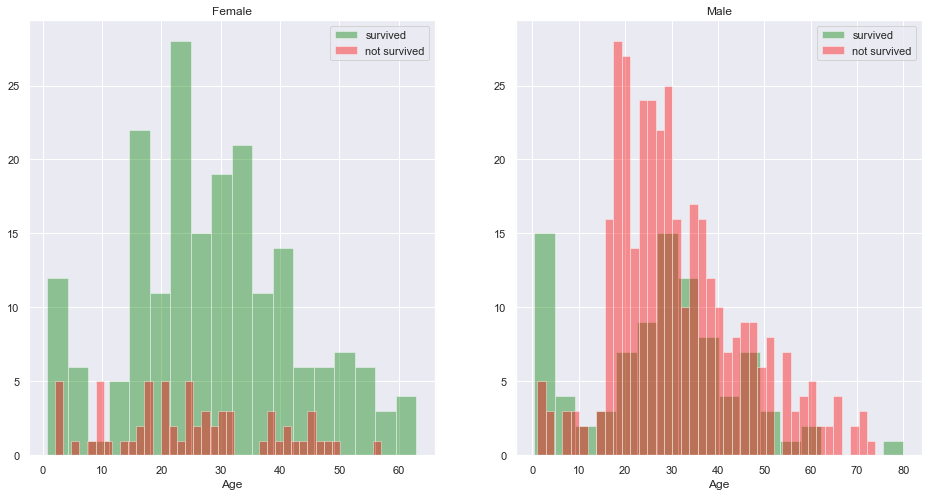</p>
나이에 따라 생존률의 차이가 있음을 확인할 수 있다. 따라서 결측치를 채워 사용하기로 했다.   
<br><br>

- Pclass별 생존자수 
<p align="center">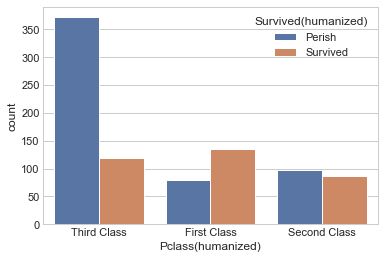</p>

- Embarked 별 생존자수
<p align="center">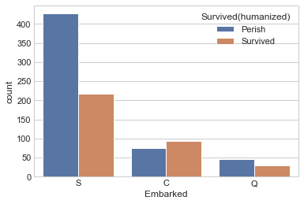</p>

- Sex별 생존자수
<p align="center">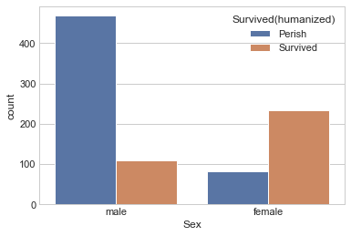</p>

- Family 별 생존자수
<p align="center">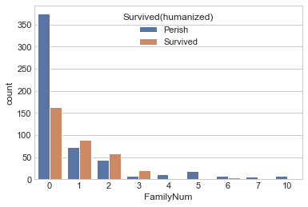</p>

- Name 호칭 별 생존자수
<p align="center">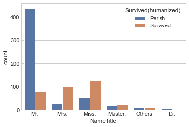</p>

- Age 별 생존자수
<p align="center">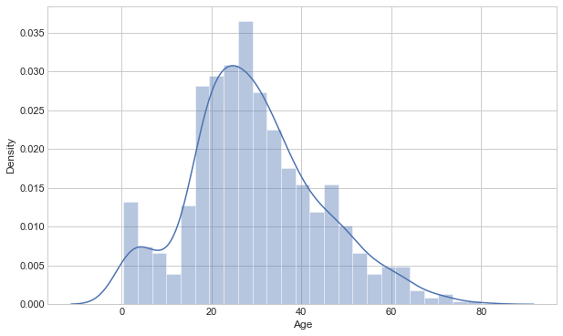</p>

- Age 나이대별 생존자수
<p align="center">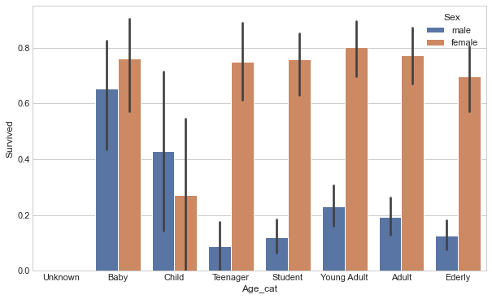</p>

- Fare 별 생존자수
<p align="center">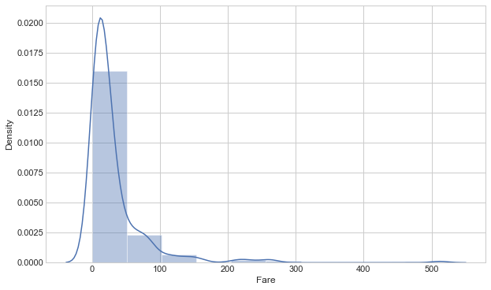</p>

- Cabin별 생존자수
<p align="center">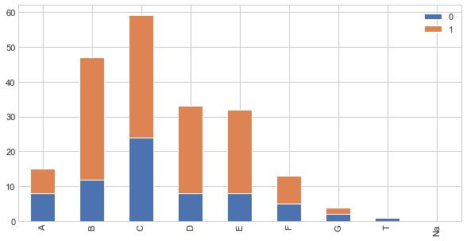</p>
<br><br>

## 2. 데이터 분석
1. SibSp 숫자에 따라 생존률이 차등이 있었다
2. Parch 숫자에 따라 생존률이 차등이 있었다
3. Pclass는 낮은 클라스 일수록 사망률이 높았다. (3rd > 2nd > 1st)
4.성별에 따라 생존률이 차등이 있었다.
5. 탑승장소에 따라 생존률 차등이 있었다.
6. 운임은 폭이 너무 커 log로 변환한 뒤 확인이 필요하다
<br><br>

## 3. 여러 ML모델에 대해 학습 및 정확도 확인
- KNN(KNeighborsClassifier)
<p align="center">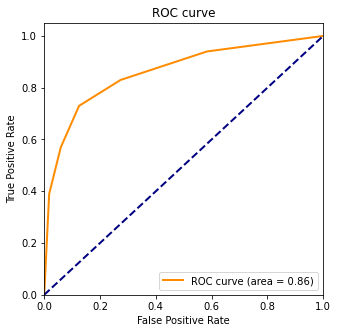</p>
Accuracy on Training set: 0.864
<br>  
Accuracy on Test set: 0.821  
<br><br>

- Random Forest Tree
<p align="center"></p>
Accuracy on Training set: 0.828
<br>
Accuracy on Test set: 0.806
<br><br>

- Gradient Boosting
<p align="center"></p>
Accuracy on Training set: 0.957
<br>  
Accuracy on Test set: 0.828
<br><br>

- XGBoost (Extreme Gradient Boosting)
<p align="center">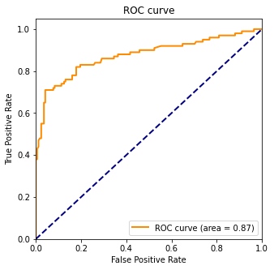</p>
Accuracy on Training set: 0.894  
<br>
Accuracy on Test set: 0.828
<br><br>

Train Data set으로 모델 튜닝을 한 결과 오히려 Test Set에 대해 정확도가 더 낮아짐
-> 데이터의 수가 너무 적어 Train Data로 모델튜닝을 한 결과로 나온 하이퍼 파라미터가 의미가 없음

-> 임의로 전체 데이터셋을 가지고 k-fold 하여 최적의 파라미터 찾기
```
n_estimators = np.linspace(100,500,5,dtype = int)
learning_rate = np.logspace(-4, -1, 4)
max_depth = np.linspace(2,5,4, dtype = int)

best_accuracy = 0

for n in n_estimators:
    for l in learning_rate:
        for m in max_depth:
            accuracy_history = []
            for train_index, test_index in str_kf.split(x_data, y_data):
                X_train, X_test = x_data.loc[train_index], x_data.loc[test_index]
                y_train, y_test = y_data.loc[train_index], y_data.loc[test_index]

                x_train_transformed , x_test_transformed = pipe_processing(X_train, X_test)

                model =  XGBClassifier(n_jobs = -1, learning_rate = l, n_estimators = n, max_depth = m, random_state=random_state, eval_metric='mlogloss')
                model.fit(x_train_transformed, y_train) # <- x_train_transformed (not x_train)

                y_pred = model.predict(x_test_transformed) # 예측 라벨
                accuracy_history.append(accuracy_score(y_pred, y_test)) # 정확도 측정 및 기록

            if best_accuracy < float(np.mean(accuracy_history)):
                best_n = n
                best_l = l
                best_m = m
                best_accuracy = float(np.mean(accuracy_history))

print("n_estimators: ",best_n,"learning_rate: ",best_l, "max_depth: ", best_m )
print("Best Mean Accuracy :", best_accuracy)
```

## 4. Stacking을 통한 성능 향상

- Stacking(GB, RandomForest, XGB)
<p align="center">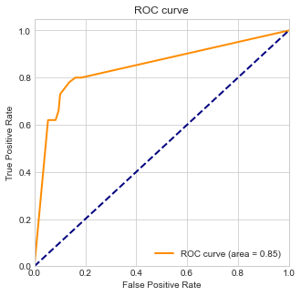</p>
Accuracy on Training set: 0.830
<br>
Accuracy on Test set: 0.832
<br><br>

- Stacking(GB, KNN, XGB)
<p align="center">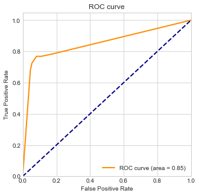</p>
Accuracy on Training set: 0.826
<br>   
Accuracy on Test set: 0.860

### 추가
 * test size를 0.3 → 0.2로 변경할 경우 train데이터의 양이 증가하여 더 높은 정확도를 얻을 수 있었다.

 ### **Reference**
 [kaggle titanic](https://www.kaggle.com/competitions/titanic)  
 [scikit-learn](https://scikit-learn.org/stable/)  
 [seaborn](https://seaborn.pydata.org/)